<p align="center">
  
</p>

<p align="center">
  <a href="https://github.com/Dullne/TrainFactory/stargazers"></a>
  <a href="https://github.com/Dullne/TrainFactory/network/members"></a>
</p>

<p align="center">
  
  
  
  
  
  
</p>

<p align="center">
  <b>All-in-one platform for LLM/Embedding/Reranker model training, deployment & evaluation</b>
</p>

<p align="center">
  English | <a href="README_CN.md">中文</a>
</p>

<p align="center">
  <a href="#features">Features</a> •
  <a href="#screenshots">Screenshots</a> •
  <a href="#quick-start">Quick Start</a> •
  <a href="#docker-deployment">Docker</a> •
  <a href="#api-docs">API Docs</a> •
  <a href="#project-structure">Structure</a>
</p>

---

## Features

### Model Training
- **Multiple model types**: LLM (Causal LM), Embedding (SentenceTransformer), Reranker (CrossEncoder), Decoder Reranker (Qwen3-Reranker)
- **Training methods**:
  - LLM: SFT, DPO, ORPO
  - Decoder Reranker: SFT, DPO, GRPO, DAPO, DR_GRPO
  - Embedding / Reranker: SFT
- **Data formats**: Messages/Chat, Instruction/Alpaca, ShareGPT, QA, preference datasets
- **Data sources**: HuggingFace Hub, ModelScope, local files
- **LoRA fine-tuning**: PEFT LoRA parameter-efficient fine-tuning
- **DeepSpeed**: Zero-2/Zero-3 distributed training support
- **Multi-GPU**: Distributed training across multiple GPUs
- **Real-time monitoring**: Live loss curves and training progress

### Model Deployment
- **Inference frameworks**: Xinference, vLLM, SGLang
- **Containerized**: One-click Docker deployment with automatic lifecycle management
- **Flexible GPU allocation**: Shared or dedicated GPU modes
- **LoRA hot-loading**: Dynamic LoRA adapter loading
- **Endpoint testing**: Built-in API connectivity test

### Model Evaluation
- **MTEB benchmarks**: Multi-dataset, multi-model parallel evaluation
- **Deep Evaluation**: Built on DeepEval framework, supports retrieval relevance and answer quality metrics (Answer Relevancy, Faithfulness, Contextual Precision/Recall/Relevancy), with more evaluation scenarios planned
- **Resumable**: Resume evaluation from breakpoints
- **Multi-model comparison**: Concurrent evaluation across model groups

### Data Generation
- **LLM-powered**: Batch generate training data from documents using LLMs
- **5 generation modes**:
  - `doc_to_training`: Documents → QA + positive/negative training data
  - `qa_to_training`: QA dataset → positive/negative training data
  - `qa_extraction`: Documents → QA pairs (with chunk association)
  - `doc_to_eval`: Documents → deep evaluation dataset
  - `qa_to_eval`: QA dataset → deep evaluation dataset
- **Pos/neg generation methods**: Vector retrieval + evaluation classification (`retrieval`) or pure LLM generation (`llm`)
- **Role generation**: Auto-generate differentiated roles for diverse QA / pos-neg perspectives
- **Quality control**: Document quality assessment, keypoint extraction, validation filtering
- **Collection reuse**: Select existing vector collections or auto-create new ones

### Vector DB Management
- **Independent collections**: Milvus collections as standalone entities bound to a unique embedding model
- **Many-to-many**: One collection can link to multiple datasets and vice versa
- **Collection reuse**: Generation and evaluation tasks can select from existing collections
- **Browse & search**: Online entity browsing and semantic search

### External Data Sync
- **Incremental sync**: Time-based incremental data fetching with automatic pagination
- **Boundary dedup**: Rollback time window + composite key (id:session_id:doc_id) dedup to handle same-timestamp pagination splits
- **Two-level threshold trigger**: Auto-trigger generation when data accumulates → auto-trigger training when generation completes
- **End-to-end automation**: External data → incremental fetch → data generation → model training → LoRA hot-loading

### Other Features
- **Web UI**: React + Ant Design modern management interface
- **REST API**: Full-featured FastAPI endpoints
- **MySQL persistence**: Task state persistence
- **GPU monitoring**: Real-time GPU usage display

---

## Screenshots

### Training

<details>
<summary>Create Training Task</summary>

Configure model type, training method, LoRA params, GPU selection, etc.

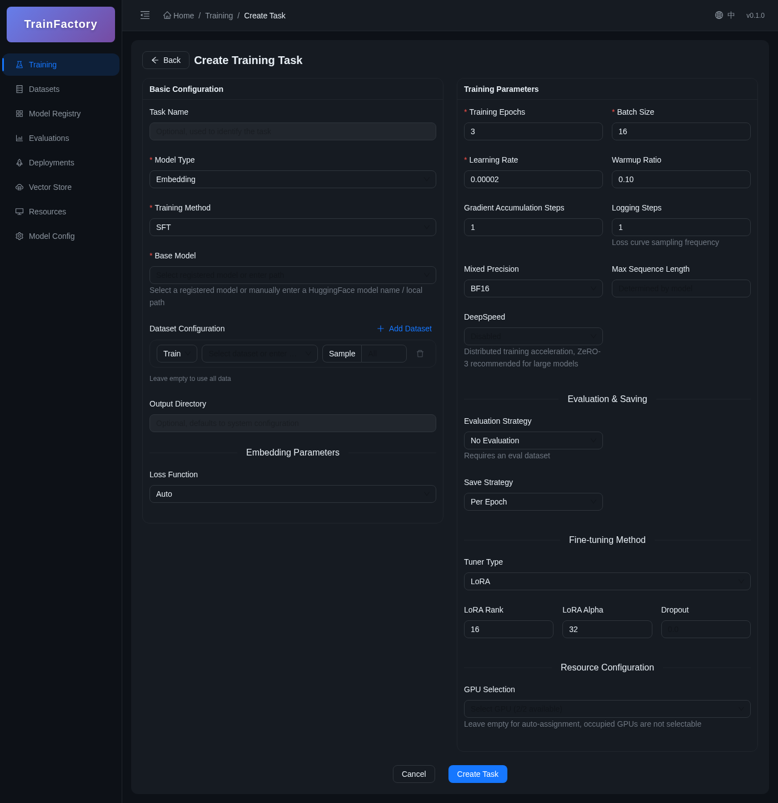

</details>

<details>
<summary>Training Detail & Loss Curve</summary>

Real-time training progress, loss curves, and task configuration

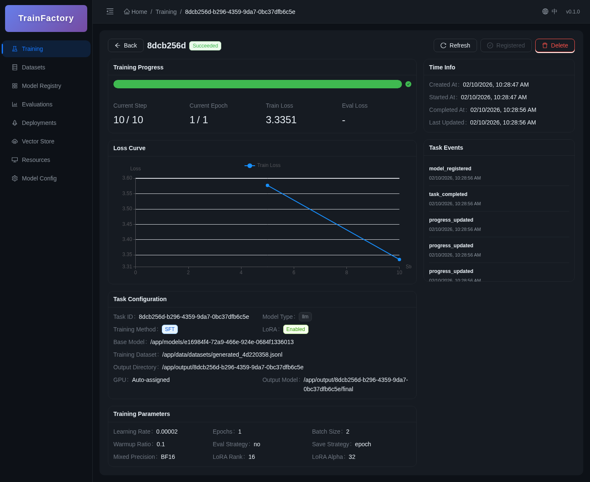

</details>

### Datasets

<details>
<summary>Dataset List</summary>

Supports JSONL, Parquet, and custom formats

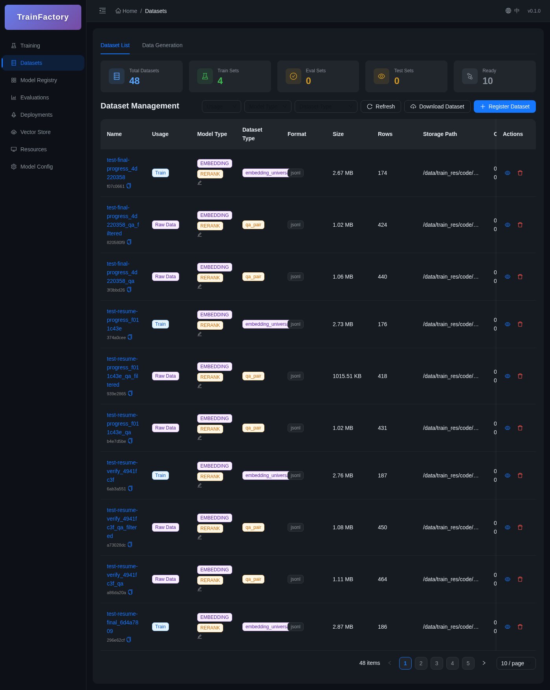

</details>

### Model Registry

<details>
<summary>Model List</summary>

Trained models are auto-registered, one-click deployment

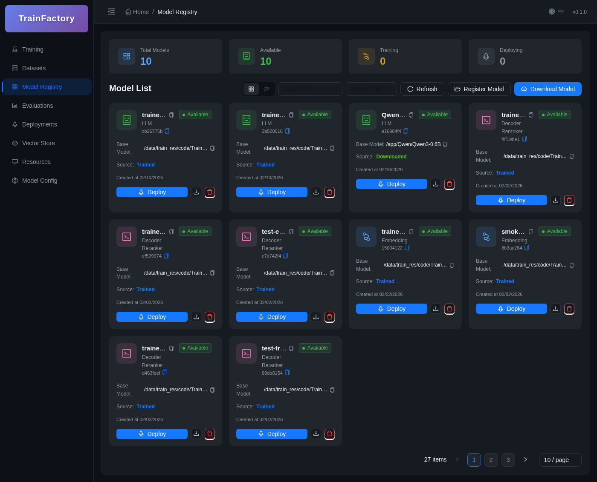

</details>

### Deployments

<details>
<summary>Deployment List</summary>

Supports Xinference, vLLM, SGLang inference frameworks

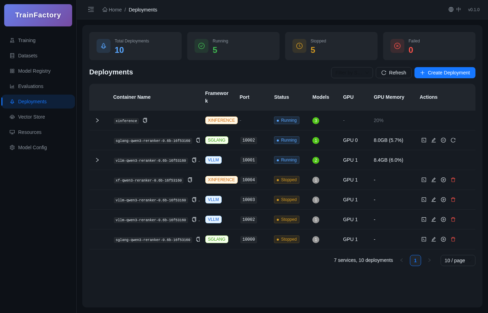

</details>

<details>
<summary>Create Deployment</summary>

Shared/dedicated GPU modes with flexible port and resource configuration

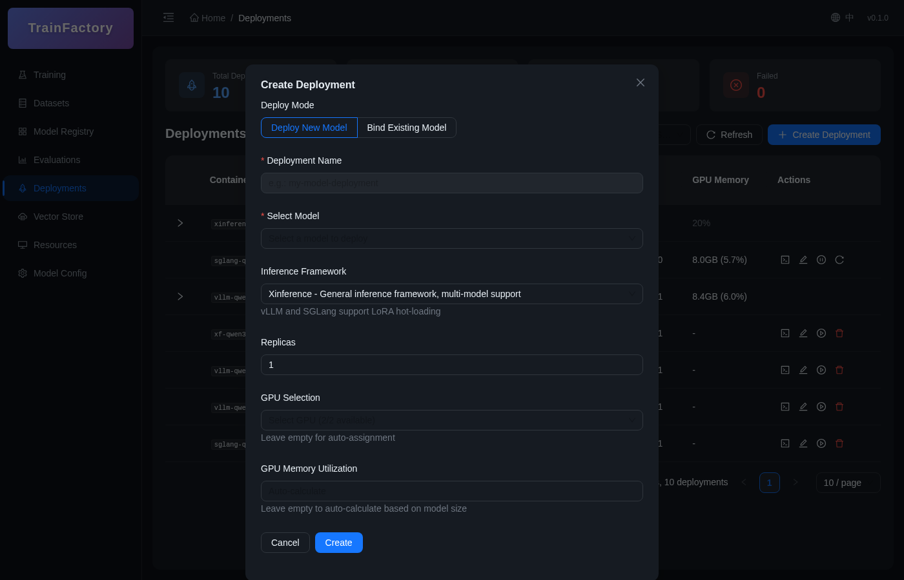

</details>

For vLLM and SGLang container deployments, the creation form exposes common
runtime controls without requiring operators to write raw command lines:

- Independent replica count, port, and GPU assignment per replica
- Tensor, pipeline, and data parallel sizes (`TP`, `PP`, `DP`)
- Context length, maximum concurrent requests, dtype, and quantization
- KV-cache dtype and GPU memory utilization
- Expert parallelism and eager execution for vLLM
- Expert parallelism and attention backend for SGLang

Each replica is an independent inference instance with its own endpoint and
lifecycle actions. TrainFactory does not add an application-level load balancer;
operators can publish the selected endpoints through Kubernetes, an ingress, or
another load-balancing layer.

### Model Configs

<details>
<summary>Config List</summary>

Manage endpoint configs for internal deployments and external APIs

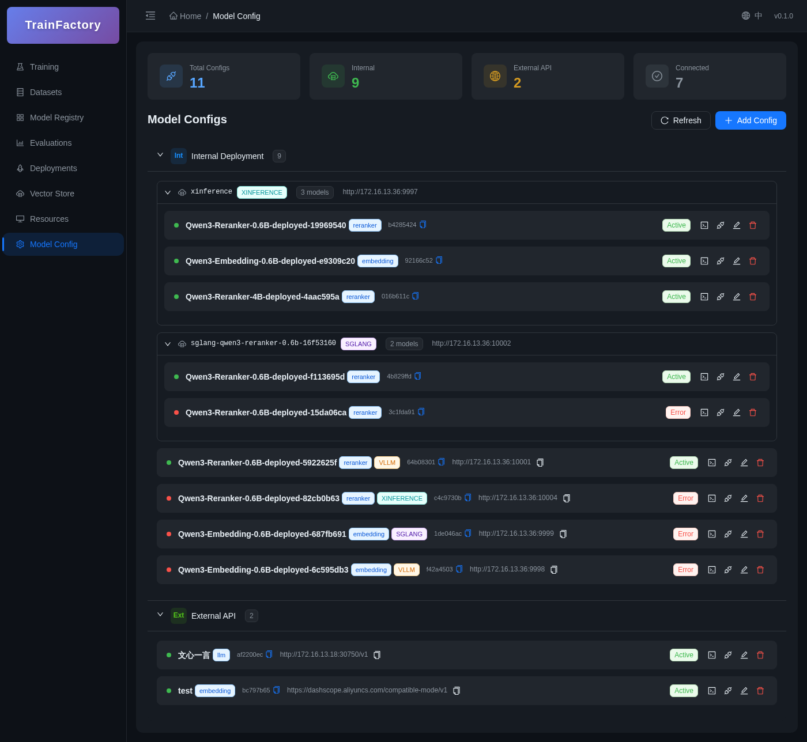

</details>

### Evaluations

<details>
<summary>MTEB Evaluation</summary>

Multi-model, multi-dataset parallel evaluation

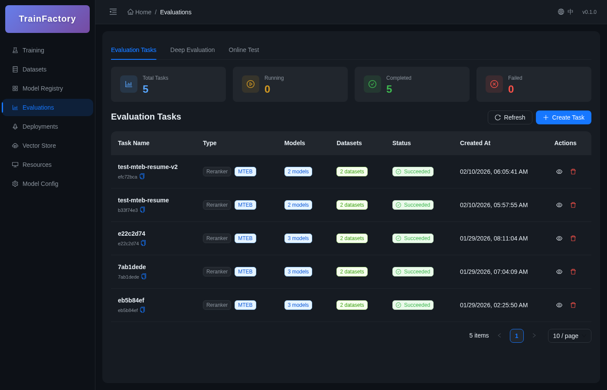

</details>

<details>
<summary>Deep Evaluation</summary>

Built on DeepEval framework. Supports retrieval relevance and answer quality metrics (Answer Relevancy, Faithfulness, Contextual Precision/Recall/Relevancy), with more evaluation scenarios planned

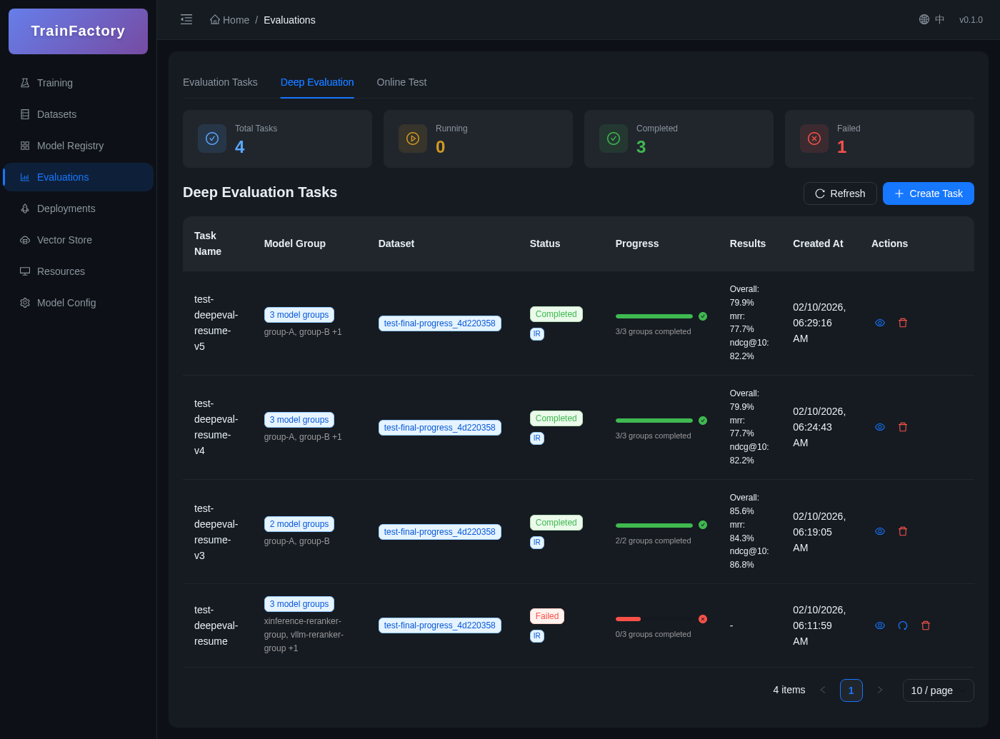

</details>

### Data Generation

<details>
<summary>Create Generation Task</summary>

Batch generate training data from documents using LLMs

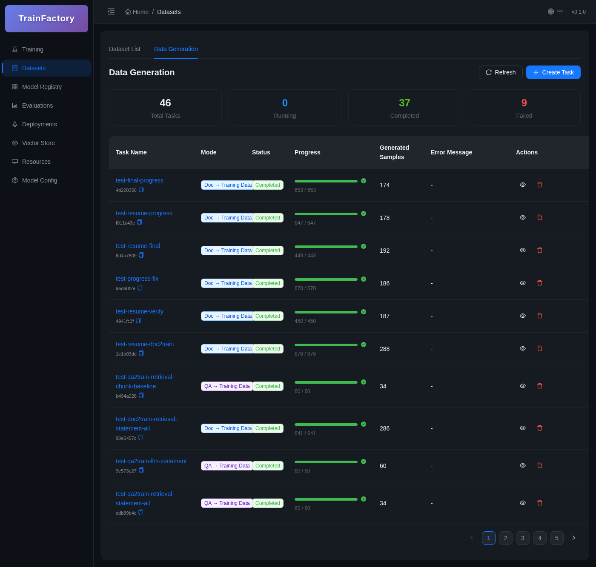

</details>

### Vector DB Management

<details>
<summary>Collection List</summary>

Manage Milvus collections independently, showing linked datasets and embedding models

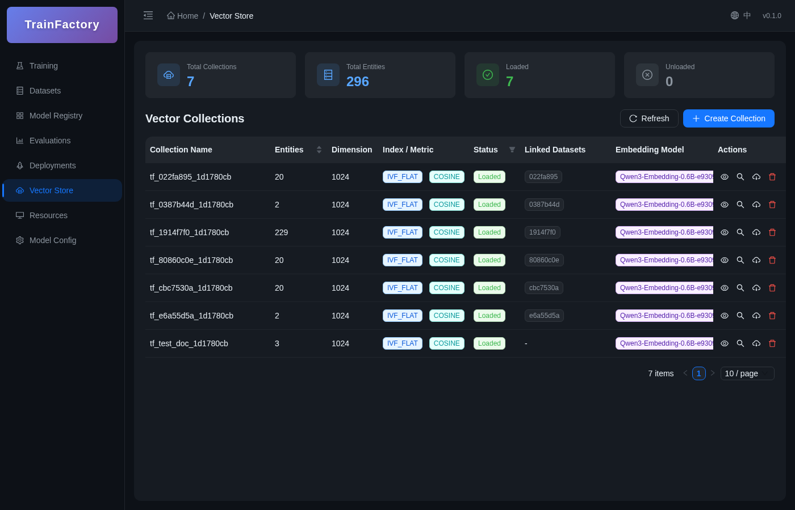

</details>

### Resource Monitoring

<details>
<summary>GPU Monitor</summary>

Real-time GPU utilization, memory, temperature, and power

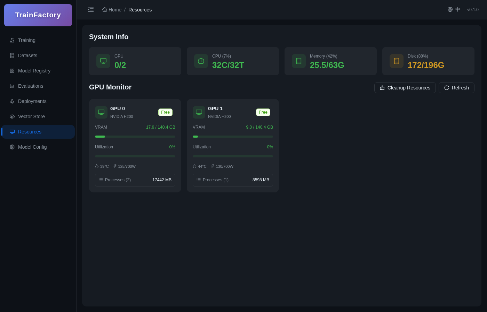

</details>

### Data Sync

<details>
<summary>External Data Sync</summary>

Incremental data fetching → two-level threshold auto-triggers generation and training → LoRA hot-loading, fully automated pipeline

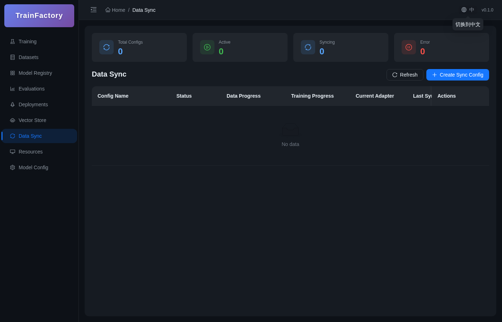

</details>

---

## Quick Start

### Requirements

- Python 3.10+
- Node.js 18+
- MySQL 8.0+
- NVIDIA GPU (CUDA 11.8+)
- Docker & Docker Compose (optional)

### Installation

```bash
# Clone repository
git clone https://github.com/Dullne/TrainFactory.git
cd TrainFactory

# Install Python dependencies
pip install -e .

# Install frontend dependencies
cd web && npm install && cd ..
```

### Start Services

```bash
# Start backend API
python -m train_factory.api.server

# Start frontend dev server
cd web && npm run dev
```

### Python API Usage

```python
from train_factory import train

# Train an embedding model
result = train(
    model_type="embedding",
    base_model_path="BAAI/bge-base-zh-v1.5",
    train_dataset_path="./data/train.jsonl",
    output_dir="./output",
    num_train_epochs=3,
    per_device_train_batch_size=16,
    learning_rate=2e-5,
)

print(f"Model saved to: {result.save_dir}")
```

### REST API Usage

```bash
# Create training task
curl -X POST http://localhost:18000/api/train \
  -H "Content-Type: application/json" \
  -d '{
    "model_type": "embedding",
    "base_model_path": "BAAI/bge-base-zh-v1.5",
    "datasets": [
      { "path": "./data/train.jsonl", "split": "train" }
    ],
    "num_train_epochs": 3
  }'

# Get task status
curl http://localhost:18000/api/train/{task_id}

# List all tasks
curl http://localhost:18000/api/train
```

---

## Docker Deployment

### Local HTTP

Use this mode only on the local machine. Populate the four direct secret values
in `.env`, keep every `*_SECRET_PATH` empty, and bind every published port to
loopback.

```powershell
[IO.File]::Copy('.env.example', '.env', $false) # Fails if .env already exists.
$env:HOST_BIND_ADDRESS = '127.0.0.1'
$env:PUBLIC_BASE_URL = 'http://localhost:3000'
$env:AUTH_COOKIE_SECURE = 'false'
$composeArgs = @('--env-file', '.env', '-f', 'docker/docker-compose.yml')

docker compose @composeArgs config --quiet
docker compose @composeArgs up -d --wait --wait-timeout 600 `
  mysql train-factory-api train-factory-web
```

#### LAN access to the Web UI (optional)

To expose only the Web UI to another device on the same trusted LAN, uncomment
or add this entry in `.env`:

```dotenv
WEB_HOST_BIND_ADDRESS=0.0.0.0
```

Then replace only the existing Web container:

```powershell
docker compose @composeArgs up -d --wait --wait-timeout 600 train-factory-web
```

Keep `PUBLIC_BASE_URL=http://localhost:3000` and `AUTH_COOKIE_SECURE=false` for
this local HTTP mode. Port 3000 listens on every host interface, so allow the
port through Windows Firewall when required. Use this only on a trusted LAN;
public or untrusted networks require the HTTPS mode below.

### Public HTTPS

This mode requires an external TLS reverse proxy. Replace the documentation IP
and host name, terminate TLS on the proxy, and forward only to the Web port.
Restrict the API and other published ports with the host firewall; do not expose
them directly to the Internet. Trust only the Web proxy container CIDR when
deriving client addresses. The commands below use file secret mode: leave the
four corresponding direct values empty, provision all five secret files, and
set their `*_SECRET_PATH` values in the operator-owned env file before running
the dry-run.

```powershell
[IO.File]::Copy('.env.example', '.env', $false) # Fails if .env already exists.
$secretEnv = '<operator-owned-path-env>'
$env:COMPOSE_PROJECT_NAME = 'trainfactory'
$env:HOST_BIND_ADDRESS = '192.0.2.10' # Replace with a real server interface IP.
$env:PUBLIC_BASE_URL = 'https://train.example.com'
$env:AUTH_COOKIE_SECURE = 'true'
$env:RATE_LIMIT_TRUSTED_PROXIES = '172.18.0.4/32'
$composeArgs = @(
  '--env-file', '.env', '--env-file', $secretEnv,
  '-f', 'docker/docker-compose.yml',
  '-f', 'docker/docker-compose.secrets.yml'
)

docker compose @composeArgs config --quiet
docker compose @composeArgs up -d --wait --wait-timeout 600 `
  mysql train-factory-api train-factory-web
```

The direct and file-backed secret modes are mutually exclusive. See
[`secrets/README.md`](secrets/README.md) before enabling the secrets overlay.

> To enable Milvus/S3, set `STORAGE_BACKEND=s3` and provide random
> `MINIO_ACCESS_KEY` and `MINIO_SECRET_KEY` values in `.env`. Reuse the
> `$composeArgs` from the selected secret mode: first run
> `docker compose @composeArgs --profile vector config --quiet`, then run
> `docker compose @composeArgs --profile vector up -d etcd minio milvus train-factory-api`.
> The MinIO console
> listens only on `127.0.0.1:9001` by default; its object-storage API is not
> published to the host.
>
> If the host driver supports CUDA 12.x minor-version compatibility but is older
> than the minimum declared by the base image, add
> `-f docker/docker-compose.gpu-compat.yml` to the commands above. This overlay
> bypasses the image's minimum-driver check; use it only after confirming driver
> compatibility, then verify `nvidia-smi` and `torch.cuda.is_available()` before
> training.

### Reproducible updates and release identity

Run lock generation only in the pinned Python 3.11/uv 0.11.19 environment.
`--write` is the only command that updates the committed requirements locks;
the second command regenerates them in a temporary tree and requires an exact
byte match.

```powershell
python -I scripts/check_dependency_locks.py --write
python -I scripts/check_dependency_locks.py
```

Resolve every base-image tag to a manifest digest, update the corresponding
`KEY=repository@sha256:<digest>` entry in `docker/images.lock.env`, and then run
the static gate. Never replace a digest with a floating tag.

```powershell
$imageTag = '<registry>/<image>:<tag>'
docker buildx imagetools inspect $imageTag
python -I scripts/validate_compose_config.py `
  --images-lock docker/images.lock.env --require-digests
```

A release build requires a clean tracked tree. It creates API/Web tags in the
form `<version>-<short-sha>`, writes the immutable image IDs to the ignored
`.runtime/release.env`, and sets the OCI `version`, `revision`, `created`, and
`source` labels. These commands only validate and build artifacts; they do not
change the running deployment. Activate a release only through a frozen Compose
manifest and `scripts/compose_release.py` as specified by the release runbook,
never by passing `.runtime/release.env` to an ad hoc base Compose command.

```powershell
python -I scripts/build_release.py --check
python -I scripts/build_release.py --build
```

Migration `053_validate_lifecycle_schema` has a deliberately non-destructive
`downgrade()`: moving the Alembic revision backward does not remove repaired
schema or data. It is not a production rollback mechanism; use a verified
backup restore. Standard CI uses CPU images and `GPU_PREFLIGHT_MODE=off`, so a
green CI run does not prove the NVIDIA driver, CUDA runtime, or tensor path.

### Development

```bash
# Validate the exact dev profile before starting containers
docker compose --env-file .env \
  -f docker/docker-compose.yml \
  --profile dev config --quiet

# Start dev mode (hot reload)
docker compose --env-file .env \
  -f docker/docker-compose.yml \
  --profile dev up -d train-factory-api-dev train-factory-web-dev mysql

# Stop services
docker compose --env-file .env \
  -f docker/docker-compose.yml \
  --profile dev down
```

### Environment Variables

| Variable | Description | Default |
|----------|-------------|---------|
| `COMPOSE_PROJECT_NAME` | Docker Compose project name | `trainfactory` |
| `API_PORT` | Backend API port | `18000` |
| `API_WORKERS` | API worker count (currently must be 1) | `1` |
| `WEB_PORT` | Frontend port | `3000` |
| `AUTH_ENABLED` | Enable authentication | `true` |
| `JWT_SECRET_KEY` | JWT secret key | `change-me` |
| `RATE_LIMIT_DEFAULT` | Default API limit per client | `100/minute` |
| `RATE_LIMIT_LOGIN` | Login limit per client | `5/minute` |
| `RATE_LIMIT_REGISTER` | Registration limit per client | `3/hour` |
| `AUDIT_LOG_RETENTION_DAYS` | Audit log retention in days | `90` |
| `AUDIT_LOG_CLEANUP_INTERVAL_HOURS` | Audit cleanup interval in hours | `24` |
| `LOG_LEVEL` | Log level | `INFO` |
| `APP_TIMEZONE` | Application timezone (IANA name) | `UTC` |
| `MYSQL_ROOT_PASSWORD` | MySQL root password (required; not used by the API) | - |
| `MYSQL_APP_USER` | API database user | `trainfactory_app` |
| `MYSQL_APP_PASSWORD` | API database password (required) | - |
| `STORAGE_BACKEND` | Dataset storage backend (`local` or `s3`) | `local` |
| `MINIO_ACCESS_KEY` | S3/MinIO access key (required for S3) | - |
| `MINIO_SECRET_KEY` | S3/MinIO secret key (required for S3) | - |
| `MINIO_CONSOLE_PORT` | Localhost-only MinIO console port | `9001` |
| `MILVUS_PORT` | Milvus vector DB port | `19530` |
| `DATA_VOLUME` | Data directory mount (host:container) | - |
| `MODELS_VOLUME` | Models directory mount | - |
| `OUTPUT_VOLUME` | Output directory mount | - |
| `VLLM_IMAGE` | vLLM image | `vllm/vllm-openai:v0.26.0` |
| `SGLANG_IMAGE` | SGLang image | `lmsysorg/sglang:v0.5.17` |
| `XINFERENCE_IMAGE` | Xinference image | `xprobe/xinference:v3.1.0` |
| `SWANLAB_API_KEY` | SwanLab monitoring key (optional) | - |

> See `.env.example` (single root template) for full configuration
>
> The external-sync scheduler is currently an in-process API singleton, so
> `API_WORKERS` must remain `1`. Any other value fails fast during startup with
> an explicit error.

---

## API Docs

Access Swagger UI after starting services:

- **API Docs**: http://localhost:18000/docs
- **ReDoc**: http://localhost:18000/redoc

### Main Endpoints

| Module | Endpoint | Description |
|--------|----------|-------------|
| Auth | `POST /api/auth/login` | User login |
| Training | `POST /api/train` | Create training task |
| Training | `GET /api/train/{task_id}` | Get task details |
| Deployment | `POST /api/deployments` | Create deployment |
| Deployment | `POST /api/deployments/{id}/stop` | Stop deployment |
| Evaluation | `POST /api/evaluations` | Create MTEB evaluation |
| Deep Eval | `POST /api/deep-evaluation` | Create deep evaluation task |
| Config | `GET /api/configs` | List model configs |
| Dataset | `GET /api/datasets` | List datasets |
| Registry | `GET /api/registry` | List registered models |
| Generation | `POST /api/generation/tasks` | Create generation task |
| Vector DB | `GET /api/milvus/collections` | List collections |
| Vector DB | `POST /api/milvus/collections` | Create collection |
| Adapters | `GET /api/adapters` | List LoRA adapters |
| Sync | `POST /api/sync/tasks` | Create sync task |
| Sync | `POST /api/sync/tasks/{id}/start` | Start scheduled sync |
| Sync | `POST /api/sync/tasks/{id}/sync-now` | Trigger immediate sync |
| Sync | `GET /api/sync/tasks/{id}/status` | Sync status details |
| Resources | `GET /api/resources/gpu` | GPU status |

---

## Project Structure

```
TrainFactory/
├── train_factory/           # Main Python package
│   ├── api/                # REST API (FastAPI)
│   │   └── routes/         # Route definitions
│   ├── trainers/           # Trainers
│   │   ├── encoder/        # Embedding/Reranker
│   │   └── decoder/        # LLM / Decoder Reranker
│   ├── evaluation/         # MTEB evaluation
│   ├── deep_evaluation/     # Deep evaluation
│   ├── generation/         # Data generation
│   ├── deployment/         # Deployment service
│   │   └── docker_deployer.py
│   ├── sync/               # External data sync
│   │   ├── sync_manager.py # Sync scheduler
│   │   ├── sync_worker.py  # Sync executor (fetch+dedup+trigger)
│   │   └── external_client.py # External API client
│   ├── storage/            # Persistence
│   │   ├── entities/       # DB entities
│   │   ├── services/       # Services (incl. collection registry)
│   │   └── migrations/     # DB migrations
│   ├── data/               # Data processing
│   ├── losses/             # Loss functions
│   ├── tuners/             # Fine-tuning (LoRA)
│   └── config/             # Configuration
├── web/                    # React frontend
│   ├── src/
│   │   ├── pages/          # Page components
│   │   ├── components/     # Common components
│   │   ├── services/       # API services
│   │   └── types/          # TypeScript types
│   └── tests/              # Frontend tests
├── docker/                 # Docker config
│   ├── docker-compose.yml
│   └── Dockerfile.*
├── docs/                   # Documentation
└── tests/                  # Backend tests
```

---

## Data Formats

### LLM Training Data

Messages/Chat format (SFT):

```json
{"messages": [{"role": "user", "content": "Hello"}, {"role": "assistant", "content": "Hello! How can I help you?"}]}
```

Instruction/Alpaca format (SFT):

```json
{"instruction": "Translate to Chinese", "input": "Hello World", "output": "你好世界"}
```

Preference data (DPO/ORPO):

```json
{"prompt": "Explain quantum computing", "chosen": "Quantum computing leverages quantum mechanics...", "rejected": "Quantum computing is just a fast computer..."}
```

### Embedding Training Data

Triplet format (sentence1, sentence2, label):

```json
{"sentence1": "This is a sentence", "sentence2": "This is another sentence", "score": 0.8}
{"sentence1": "Query text", "sentence2": "Related document", "label": 1}
```

### Reranker Training Data

```json
{"query": "Query content", "passage": "Document content", "label": 1}
```

### Decoder Reranker (Qwen3-Reranker)

```json
{"query": "Query content", "positive": "Positive document", "negative": "Negative document"}
```

---

## Training Parameters

| Parameter | Description | Default |
|-----------|-------------|---------|
| `model_type` | Model type: `llm`, `embedding`, `reranker`, `decoder_reranker` | `embedding` |
| `training_method` | Training method (see matrix below) | `sft` |
| `base_model_path` | Base model path | - |
| `datasets` | Dataset config | - |
| `num_train_epochs` | Epochs | `3` |
| `per_device_train_batch_size` | Batch size | `16` |
| `learning_rate` | Learning rate | `2e-5` |
| `warmup_ratio` | Warmup ratio | `0.1` |
| `bf16` / `fp16` | Mixed precision | `false` |
| `use_lora` | Enable LoRA | `false` |
| `lora_r` | LoRA rank | `16` |
| `lora_alpha` | LoRA alpha | `32` |

### Training Method Support Matrix

| Model Type | SFT | DPO | ORPO | GRPO | DAPO | DR_GRPO |
|------------|-----|-----|------|------|------|---------|
| LLM | ✓ | ✓ | ✓ | | | |
| Embedding | ✓ | | | | | |
| Reranker | ✓ | | | | | |
| Decoder Reranker | ✓ | ✓ | | ✓ | ✓ | ✓ |

---

## Star History

[](https://star-history.com/#Dullne/TrainFactory&Date)

---

## Contributing

Issues and Pull Requests are welcome!

## License

[MIT License](LICENSE)
