<p align="center">
  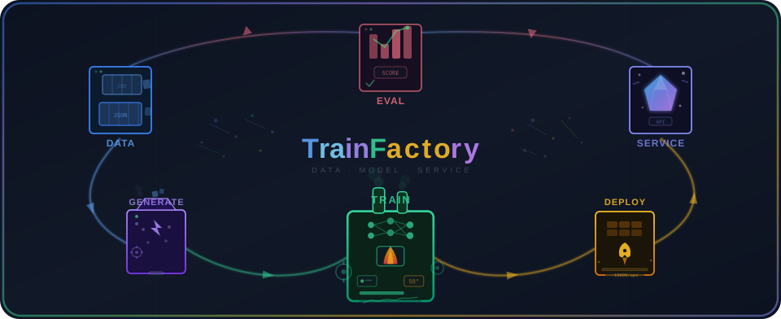
</p>

<p align="center">
  <a href="https://github.com/Dullne/TrainFactory/stargazers"></a>
  <a href="https://github.com/Dullne/TrainFactory/network/members"></a>
</p>

<p align="center">
  
  
  
  
  
  
</p>

<p align="center">
  <b>一站式 LLM/Embedding/Reranker 模型训练、部署与评估平台</b>
</p>

<p align="center">
  <a href="README.md">English</a> | 中文
</p>

<p align="center">
  <a href="#功能特性">功能特性</a> •
  <a href="#前端展示">前端展示</a> •
  <a href="#快速开始">快速开始</a> •
  <a href="#docker-部署">Docker 部署</a> •
  <a href="#api-文档">API 文档</a> •
  <a href="#项目结构">项目结构</a>
</p>

---

## 功能特性

### 模型训练
- **多模型类型**: LLM (Causal LM)、Embedding (SentenceTransformer)、Reranker (CrossEncoder)、Decoder Reranker (Qwen3-Reranker)
- **多训练方法**:
  - LLM: SFT、DPO、ORPO
  - Decoder Reranker: SFT、DPO、GRPO、DAPO、DR_GRPO
  - Embedding / Reranker: SFT
- **多数据格式**: Messages/Chat、Instruction/Alpaca、ShareGPT、QA、偏好数据集
- **多数据源**: HuggingFace Hub、ModelScope、本地文件
- **LoRA 微调**: PEFT LoRA 参数高效微调
- **DeepSpeed**: 支持 Zero-2/Zero-3 分布式训练
- **多 GPU 训练**: 多 GPU 分布式训练
- **实时监控**: 实时 Loss 曲线和训练进度

### 模型部署
- **多推理框架**: Xinference、vLLM、SGLang
- **Docker 容器化**: 一键部署，自动生命周期管理
- **灵活 GPU 分配**: 共享或独占 GPU 模式
- **LoRA 热加载**: 动态加载 LoRA 适配器
- **端点测试**: 内置 API 连通性测试

### 模型评估
- **MTEB 基准测试**: 多数据集、多模型并行评估
- **深度评估**: 基于 DeepEval 框架，支持检索相关性与答案质量指标（Answer Relevancy、Faithfulness、Contextual Precision/Recall/Relevancy），后续将扩展更多评估场景
- **断点续评**: 支持从断点恢复评估
- **多模型对比**: 多模型组并发评估

### 数据生成
- **LLM 驱动**: 使用 LLM 从文档批量生成训练数据
- **5 种生成模式**:
  - `doc_to_training`: 文档 → QA + 正负例训练数据
  - `qa_to_training`: QA 数据集 → 正负例训练数据
  - `qa_extraction`: 文档 → QA 对（含 chunk 关联）
  - `doc_to_eval`: 文档 → 深度评估数据集
  - `qa_to_eval`: QA 数据集 → 深度评估数据集
- **正负例生成方式**: 向量检索 + 评估分类 (`retrieval`) 或纯 LLM 生成 (`llm`)
- **角色生成**: 自动生成差异化角色，每个角色生成不同视角的 QA / 正负例
- **质量控制**: 文档质量评估、关键点提取、校验过滤
- **向量集合复用**: 选择已有向量集合或自动创建新集合

### 向量库管理
- **独立集合管理**: Milvus 集合作为独立实体，绑定唯一 Embedding 模型
- **多对多关联**: 一个集合可关联多个数据集，一个数据集可关联多个集合
- **集合复用**: 生成任务和评估任务可选择已有集合
- **数据浏览与搜索**: 在线实体浏览和语义搜索

### 外部数据同步
- **增量同步**: 基于时间戳的增量数据拉取，自动分页处理
- **边界去重**: 回退时间窗口 + 组合键 (id:session_id:doc_id) 去重，解决同时间戳分页截断问题
- **两级阈值触发**: 数据累积到阈值自动触发生成任务 → 生成完成触发训练任务
- **全流程自动化**: 外部数据 → 增量拉取 → 数据生成 → 模型训练 → LoRA 热加载

### 其他特性
- **Web UI**: React + Ant Design 现代化管理界面
- **REST API**: 完整的 FastAPI 接口
- **MySQL 持久化**: 任务状态持久化存储
- **GPU 资源监控**: 实时 GPU 使用情况展示

---

## 前端展示

### 训练管理

<details>
<summary>创建训练任务</summary>

支持配置模型类型、训练方法、LoRA 参数、GPU 选择等

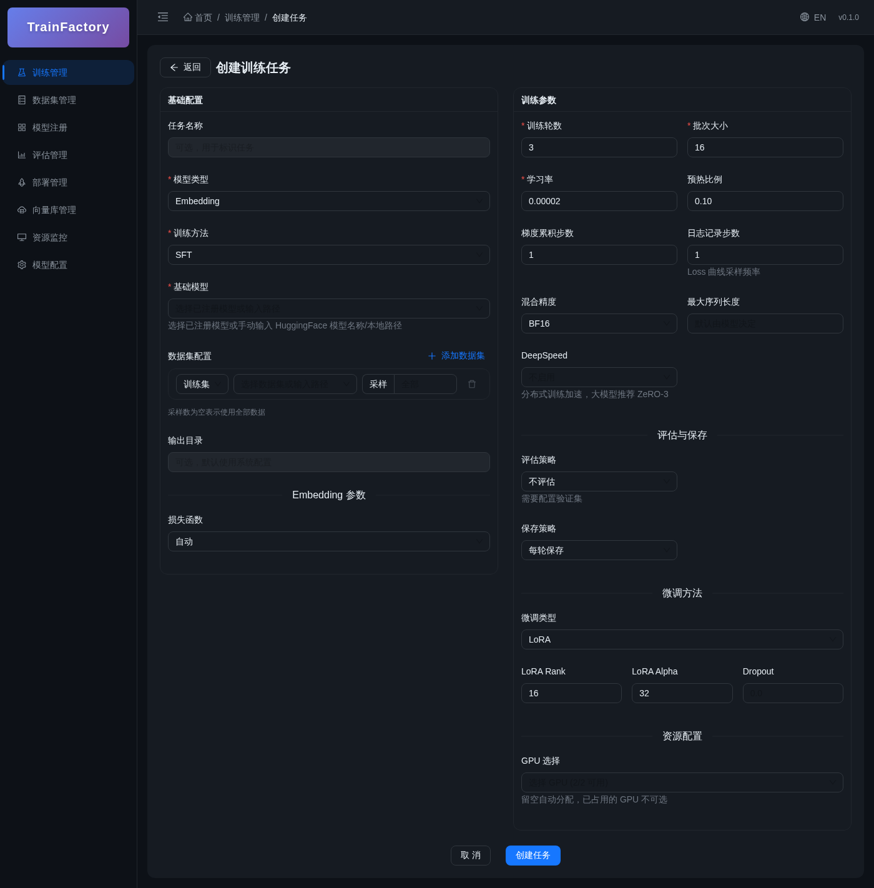

</details>

<details>
<summary>训练详情 & Loss 曲线</summary>

实时展示训练进度、Loss 曲线和任务配置

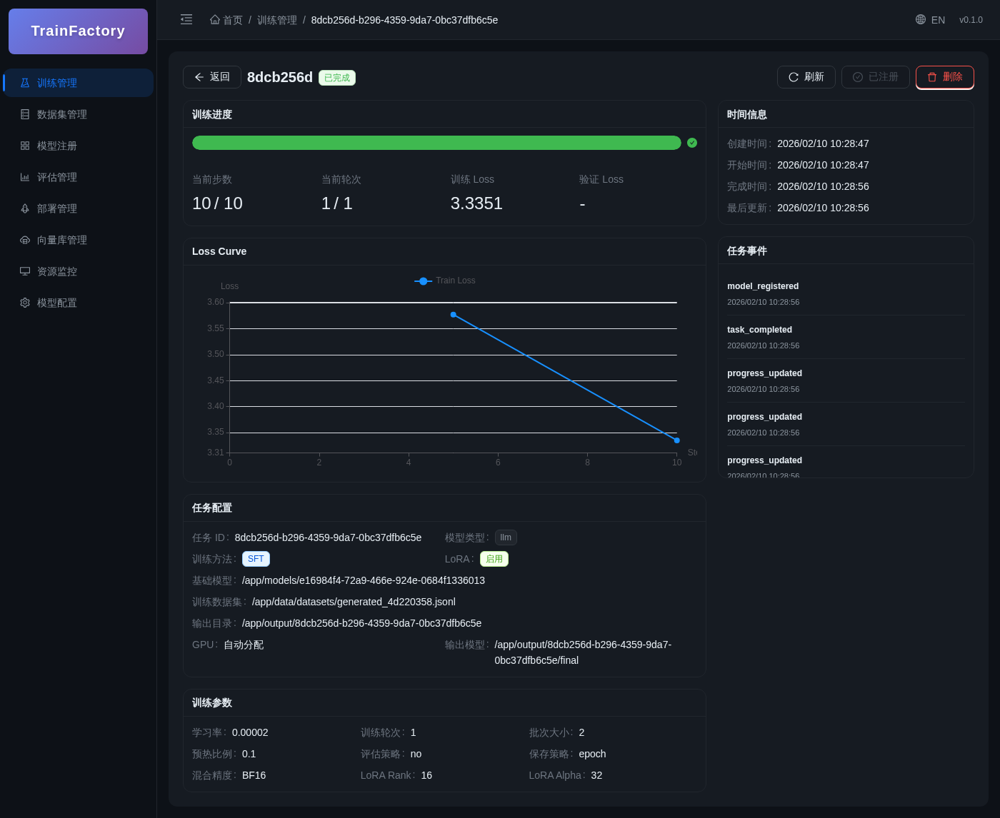

</details>

### 数据集管理

<details>
<summary>数据集列表</summary>

支持多种数据格式：JSONL、Parquet、自定义格式

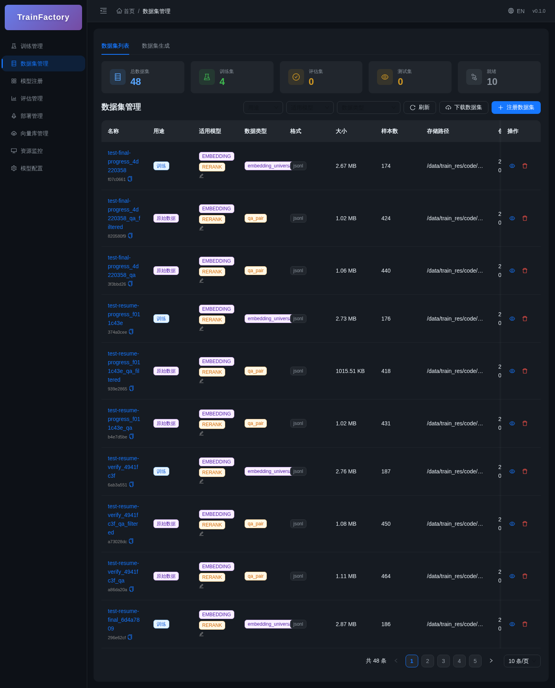

</details>

### 模型注册

<details>
<summary>模型列表</summary>

训练完成的模型自动注册，支持一键部署

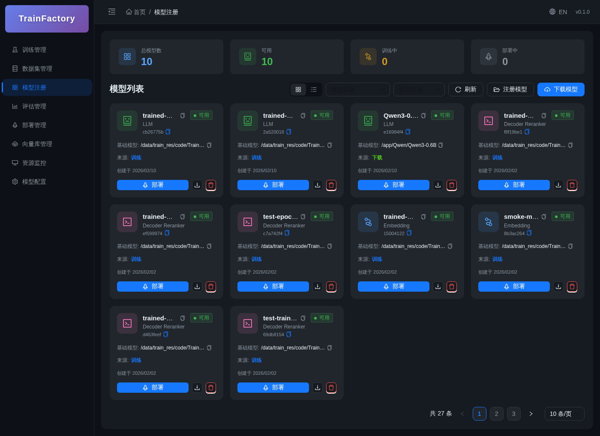

</details>

### 部署管理

<details>
<summary>部署列表</summary>

支持多种推理框架：Xinference、vLLM、SGLang

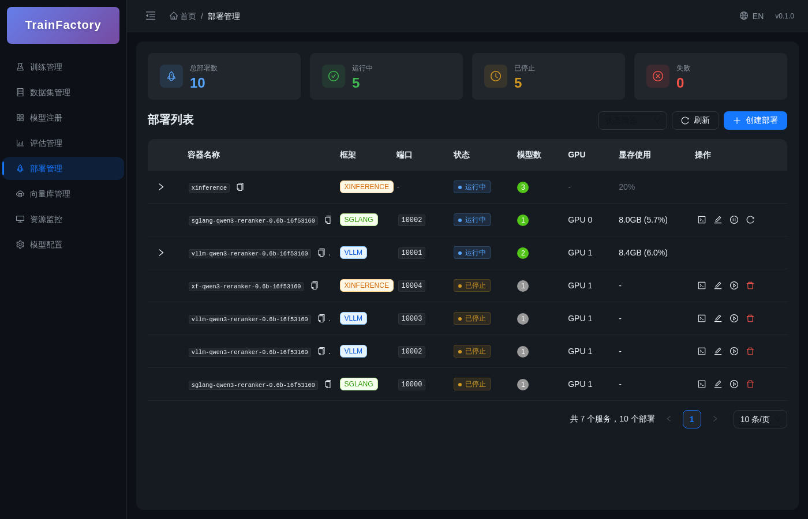

</details>

<details>
<summary>创建部署</summary>

支持共享/独立 GPU 模式，灵活配置端口和资源

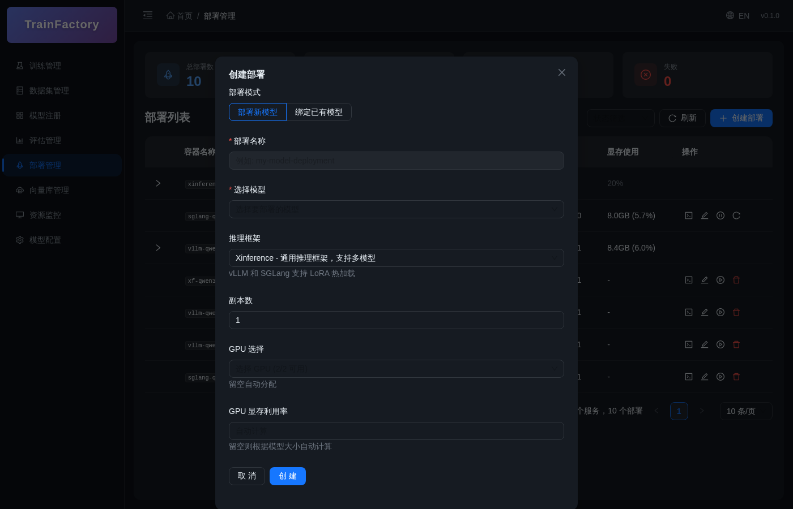

</details>

vLLM 和 SGLang 容器部署可直接在创建表单中配置常用启动参数，无需手写命令行：

- 独立实例数量，以及每个实例的端口和 GPU 分配
- 张量、流水线和数据并行度（`TP`、`PP`、`DP`）
- 上下文长度、最大并发请求数、数据类型和量化方式
- KV Cache 数据类型和 GPU 显存利用率
- vLLM 的专家并行与 Eager 执行
- SGLang 的专家并行与 Attention Backend

每个副本都是具有独立端点和生命周期操作的推理实例。TrainFactory 不额外内置
应用层负载均衡；可以通过 Kubernetes、Ingress 或其他负载均衡层发布所选端点。

### 模型配置

<details>
<summary>配置列表</summary>

管理内部部署和外部 API 的模型端点配置

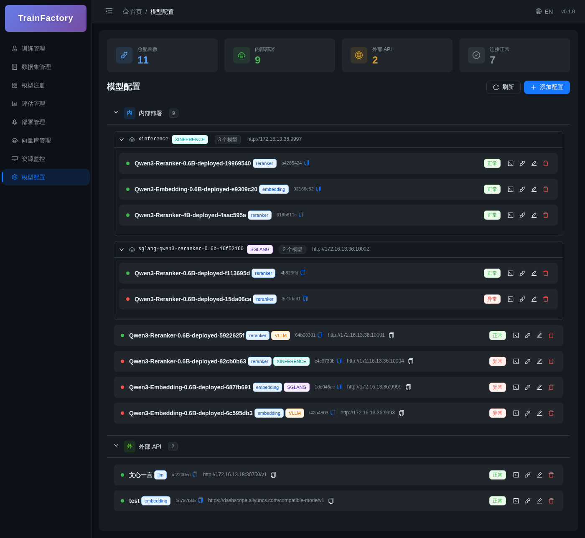

</details>

### 评估管理

<details>
<summary>MTEB 评估</summary>

支持多模型、多数据集并行评估

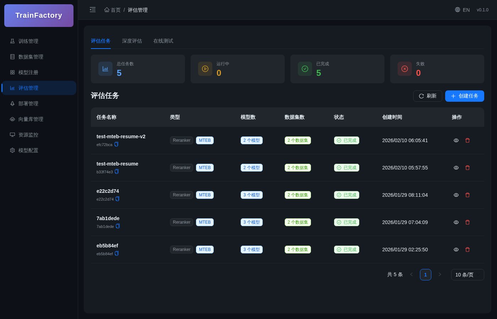

</details>

<details>
<summary>深度评估</summary>

基于 DeepEval 框架的模型评估，支持检索相关性与答案质量指标（Answer Relevancy、Faithfulness、Contextual Precision/Recall/Relevancy），后续将扩展更多评估场景

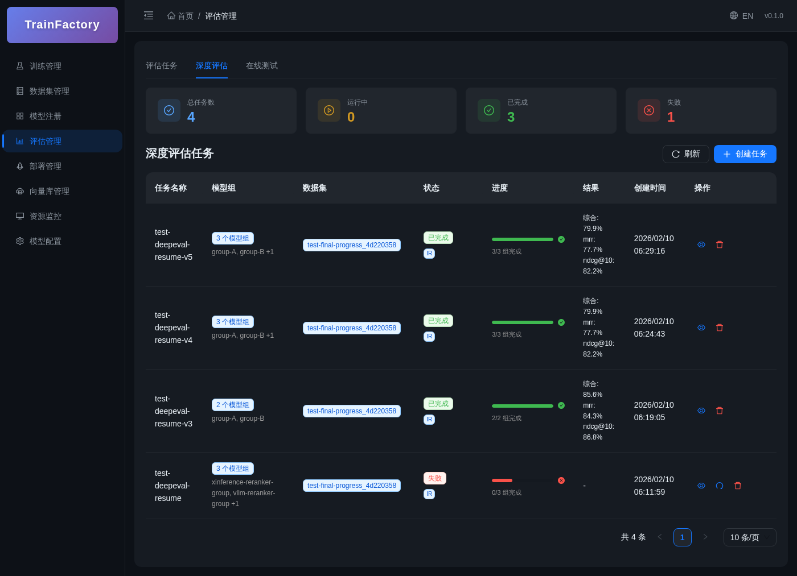

</details>

### 数据生成

<details>
<summary>创建生成任务</summary>

使用 LLM 从文档批量生成训练数据

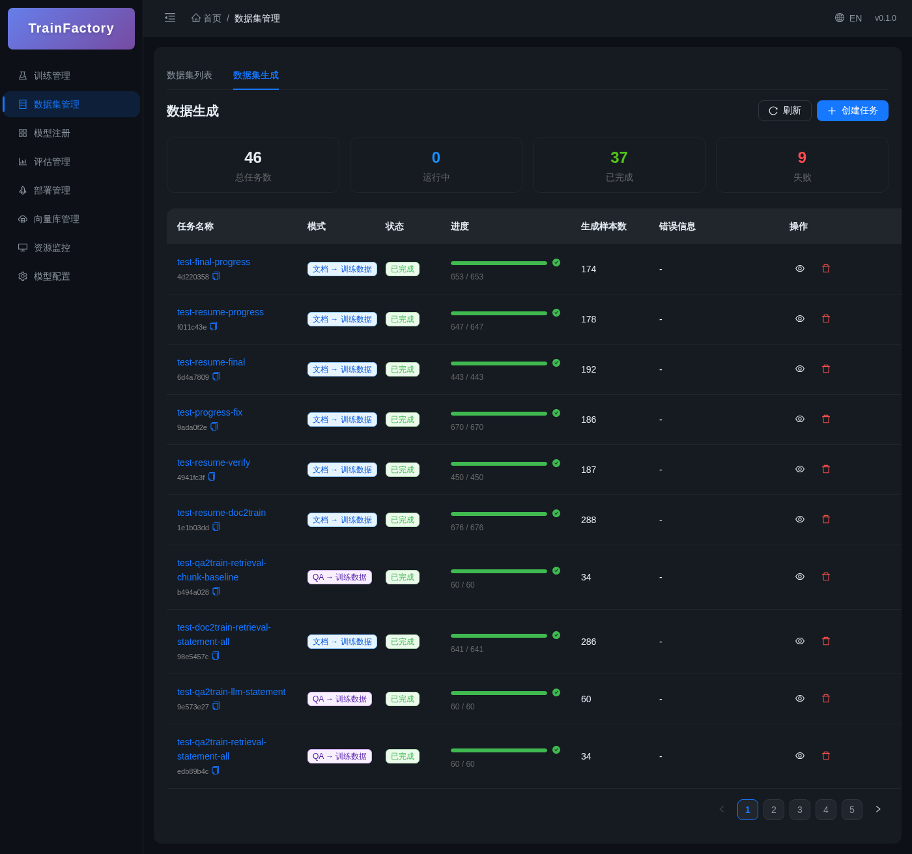

</details>

### 向量库管理

<details>
<summary>向量集合列表</summary>

独立管理 Milvus 集合，展示关联数据集和 Embedding 模型

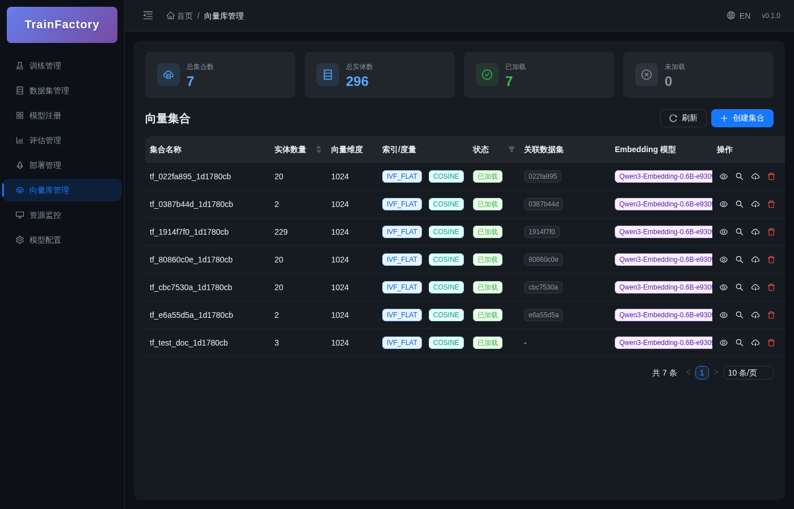

</details>

### 资源监控

<details>
<summary>GPU 监控</summary>

实时显示 GPU 使用率、显存、温度、功耗

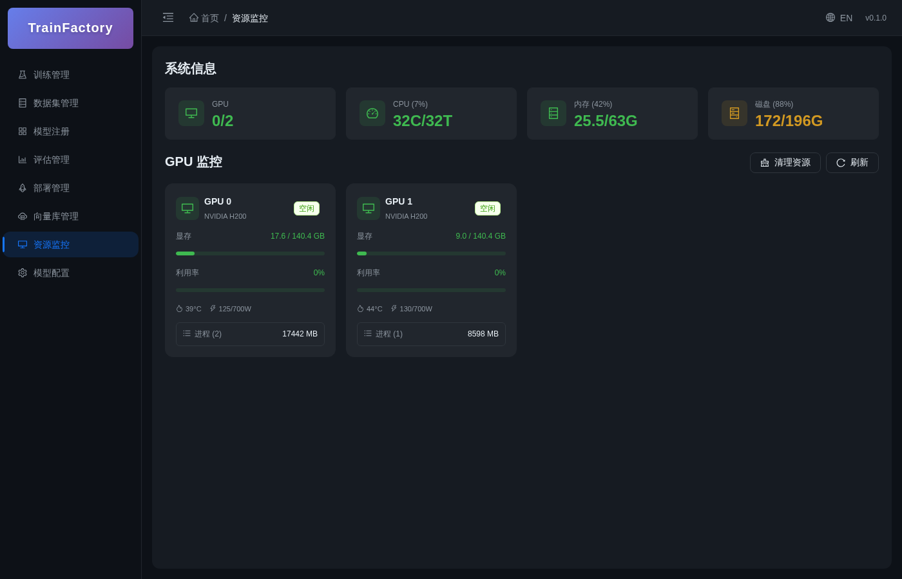

</details>

### 数据同步

<details>
<summary>外部数据同步</summary>

增量数据拉取 → 两级阈值自动触发生成和训练 → LoRA 热加载，全流程自动化

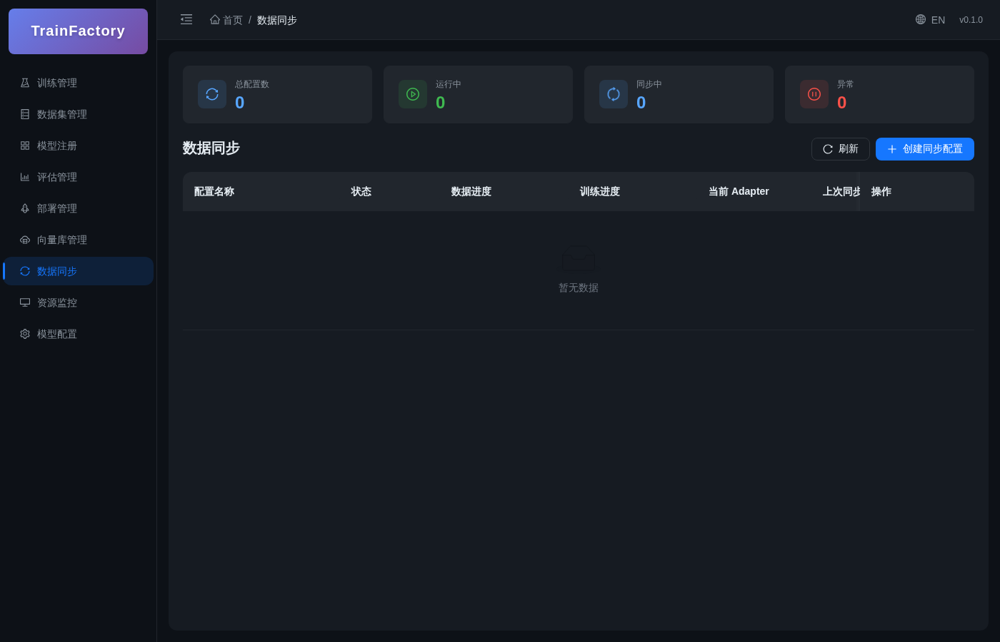

</details>

---

## 快速开始

### 环境要求

- Python 3.10+
- Node.js 18+
- MySQL 8.0+
- NVIDIA GPU (CUDA 11.8+)
- Docker & Docker Compose (可选)

### 安装

```bash
# 克隆仓库
git clone https://github.com/Dullne/TrainFactory.git
cd TrainFactory

# 安装 Python 依赖
pip install -e .

# 安装前端依赖
cd web && npm install && cd ..
```

### 启动服务

```bash
# 启动后端 API
python -m train_factory.api.server

# 启动前端开发服务器
cd web && npm run dev
```

### Python API 使用

```python
from train_factory import train

# 训练 Embedding 模型
result = train(
    model_type="embedding",
    base_model_path="BAAI/bge-base-zh-v1.5",
    train_dataset_path="./data/train.jsonl",
    output_dir="./output",
    num_train_epochs=3,
    per_device_train_batch_size=16,
    learning_rate=2e-5,
)

print(f"模型保存至: {result.save_dir}")
```

### REST API 使用

```bash
# 创建训练任务
curl -X POST http://localhost:18000/api/train \
  -H "Content-Type: application/json" \
  -d '{
    "model_type": "embedding",
    "base_model_path": "BAAI/bge-base-zh-v1.5",
    "datasets": [
      { "path": "./data/train.jsonl", "split": "train" }
    ],
    "num_train_epochs": 3
  }'

# 获取任务状态
curl http://localhost:18000/api/train/{task_id}

# 列出所有任务
curl http://localhost:18000/api/train
```

---

## Docker 部署

### 本机 HTTP

此模式仅供本机使用。在 `.env` 中填写四项 direct secret，保持所有
`*_SECRET_PATH` 为空，并把全部发布端口绑定到 loopback。

```powershell
[IO.File]::Copy('.env.example', '.env', $false) # .env 已存在时拒绝覆盖。
$env:HOST_BIND_ADDRESS = '127.0.0.1'
$env:PUBLIC_BASE_URL = 'http://localhost:3000'
$env:AUTH_COOKIE_SECURE = 'false'
$composeArgs = @('--env-file', '.env', '-f', 'docker/docker-compose.yml')

docker compose @composeArgs config --quiet
docker compose @composeArgs up -d --wait --wait-timeout 600 `
  mysql train-factory-api train-factory-web
```

#### 局域网访问 Web（可选）

本机模式下 Web 发布端口默认绑定 loopback。如需让同一局域网内的其他设备
通过 `http://<本机局域网 IP>:3000` 访问 Web 界面（不暴露 API 等其他发布
端口），在 `.env` 中取消对应注释或加入：

```dotenv
WEB_HOST_BIND_ADDRESS=0.0.0.0
```

然后只重新部署 Web 容器：

```powershell
docker compose @composeArgs up -d --wait --wait-timeout 600 train-factory-web
```

注意 `PUBLIC_BASE_URL` 保持 `http://localhost:3000` 且 `AUTH_COOKIE_SECURE=false`
（HTTP 下 Secure cookie 不会被浏览器保存）；同一宿主机上的多个网卡都会监听
3000 端口，Windows 防火墙若拦截入站需放行该端口。此模式仅适用于可信局域网；
公网或不可信网络必须使用下方 HTTPS 模式。

### 公开 HTTPS

此模式必须使用栈外 TLS 反向代理。请替换文档 IP 和域名，在代理终止
TLS，并且只转发到 Web 端口。宿主机防火墙必须阻止公网直接访问 API
及其他发布端口；客户端地址只信任 Web 代理容器的 CIDR。下面的命令使用文件
secret 模式：四项对应 direct 值保持为空，先提供全部五个 secret 文件，并在
operator-owned env 文件中设置其 `*_SECRET_PATH`，然后再执行 dry-run。

```powershell
[IO.File]::Copy('.env.example', '.env', $false) # .env 已存在时拒绝覆盖。
$secretEnv = '<operator-owned-path-env>'
$env:COMPOSE_PROJECT_NAME = 'trainfactory'
$env:HOST_BIND_ADDRESS = '192.0.2.10' # 替换为真实服务器网卡 IP。
$env:PUBLIC_BASE_URL = 'https://train.example.com'
$env:AUTH_COOKIE_SECURE = 'true'
$env:RATE_LIMIT_TRUSTED_PROXIES = '172.18.0.4/32'
$composeArgs = @(
  '--env-file', '.env', '--env-file', $secretEnv,
  '-f', 'docker/docker-compose.yml',
  '-f', 'docker/docker-compose.secrets.yml'
)

docker compose @composeArgs config --quiet
docker compose @composeArgs up -d --wait --wait-timeout 600 `
  mysql train-factory-api train-factory-web
```

direct 与文件 secret 模式互斥。启用 secrets overlay 前请先阅读
[`secrets/README.md`](secrets/README.md)。

> 如需 Milvus/S3，在 `.env` 中将 `STORAGE_BACKEND=s3`，并填写随机的
> `MINIO_ACCESS_KEY` 与 `MINIO_SECRET_KEY`。复用所选 secret 模式的
> `$composeArgs`：先运行 `docker compose @composeArgs --profile vector config --quiet`，
> 再运行 `docker compose @composeArgs --profile vector up -d etcd minio milvus train-factory-api`。
> MinIO 控制台默认仅监听
> `127.0.0.1:9001`，对象存储 API 不发布到宿主机。
>
> 当宿主机驱动支持 CUDA 12.x 次要版本兼容性、但低于基础镜像声明的最低版本时，
> 可在上述命令中额外加入 `-f docker/docker-compose.gpu-compat.yml`。该兼容层会跳过
> 镜像的最低驱动版本检查；仅应在确认驱动兼容后使用，并在训练前通过 `nvidia-smi`
> 和 `torch.cuda.is_available()` 验证 GPU。

### 可复现更新与发布身份

只在固定的 Python 3.11/uv 0.11.19 环境中更新 lock。`--write` 是唯一会
更新已提交 requirements lock 的入口；第二条命令在临时目录重新生成并要求
字节完全一致。

```powershell
python -I scripts/check_dependency_locks.py --write
python -I scripts/check_dependency_locks.py
```

基础镜像更新时，先把 tag 解析为 manifest digest，再把对应的
`KEY=repository@sha256:<digest>` 写入 `docker/images.lock.env`，最后运行静态门。
不得用浮动 tag 代替 digest。

```powershell
$imageTag = '<registry>/<image>:<tag>'
docker buildx imagetools inspect $imageTag
python -I scripts/validate_compose_config.py `
  --images-lock docker/images.lock.env --require-digests
```

release build 要求 tracked tree 干净。它生成 `<version>-<short-sha>` 形式的
API/Web tag，把不可变 image ID 写入被忽略的 `.runtime/release.env`，并设置
OCI `version`、`revision`、`created`、`source` labels。这些命令只验证并构建
artifact，不会改变当前运行的部署。发布激活只能按 release runbook 通过冻结的
Compose manifest 与 `scripts/compose_release.py` 执行，禁止把
`.runtime/release.env` 交给临时拼写的基础 Compose 命令。

```powershell
python -I scripts/build_release.py --check
python -I scripts/build_release.py --build
```

迁移 `053_validate_lifecycle_schema` 的 `downgrade()` 特意保持非破坏：回退
Alembic revision 不会删除已修复的 schema 或数据。它不是生产回滚机制；生产
回滚必须使用已验证备份。标准 CI 使用 CPU 镜像和
`GPU_PREFLIGHT_MODE=off`，因此 CI 通过不代表 NVIDIA 驱动、CUDA runtime 或
tensor 路径已经验证。

### 开发模式

```bash
# 启动容器前先验证完全相同的 dev profile
docker compose --env-file .env \
  -f docker/docker-compose.yml \
  --profile dev config --quiet

# 启动开发模式（支持代码热更新）
docker compose --env-file .env \
  -f docker/docker-compose.yml \
  --profile dev up -d train-factory-api-dev train-factory-web-dev mysql

# 停止服务
docker compose --env-file .env \
  -f docker/docker-compose.yml \
  --profile dev down
```

### 环境变量

| 变量 | 说明 | 默认值 |
|------|------|--------|
| `COMPOSE_PROJECT_NAME` | Docker Compose 项目名 | `trainfactory` |
| `API_PORT` | 后端 API 端口 | `18000` |
| `API_WORKERS` | API worker 数量（当前必须为 1） | `1` |
| `WEB_PORT` | 前端端口 | `3000` |
| `AUTH_ENABLED` | 是否启用认证 | `true` |
| `JWT_SECRET_KEY` | JWT 密钥 | `change-me` |
| `RATE_LIMIT_DEFAULT` | API 每客户端默认限流 | `100/minute` |
| `RATE_LIMIT_LOGIN` | 登录接口每客户端限流 | `5/minute` |
| `RATE_LIMIT_REGISTER` | 注册接口每客户端限流 | `3/hour` |
| `AUDIT_LOG_RETENTION_DAYS` | 审计日志保留天数 | `90` |
| `AUDIT_LOG_CLEANUP_INTERVAL_HOURS` | 审计日志清理间隔（小时） | `24` |
| `LOG_LEVEL` | 日志级别 | `INFO` |
| `APP_TIMEZONE` | 应用时区（IANA 名称） | `UTC` |
| `MYSQL_ROOT_PASSWORD` | MySQL root 密码（必填，不供 API 使用） | - |
| `MYSQL_APP_USER` | API 数据库用户 | `trainfactory_app` |
| `MYSQL_APP_PASSWORD` | API 数据库密码（必填） | - |
| `STORAGE_BACKEND` | 数据集存储后端（`local` 或 `s3`） | `local` |
| `MINIO_ACCESS_KEY` | S3/MinIO 访问密钥（启用 S3 时必填） | - |
| `MINIO_SECRET_KEY` | S3/MinIO 私密密钥（启用 S3 时必填） | - |
| `MINIO_CONSOLE_PORT` | 仅本机可访问的 MinIO 控制台端口 | `9001` |
| `MILVUS_PORT` | Milvus 向量数据库端口 | `19530` |
| `DATA_VOLUME` | 数据目录挂载 (host:container) | - |
| `MODELS_VOLUME` | 模型目录挂载 | - |
| `OUTPUT_VOLUME` | 输出目录挂载 | - |
| `VLLM_IMAGE` | vLLM 镜像 | `vllm/vllm-openai:v0.26.0` |
| `SGLANG_IMAGE` | SGLang 镜像 | `lmsysorg/sglang:v0.5.17` |
| `XINFERENCE_IMAGE` | Xinference 镜像 | `xprobe/xinference:v3.1.0` |
| `SWANLAB_API_KEY` | SwanLab 监控密钥（可选） | - |

> 完整配置参见 `.env.example`（项目根目录单一配置模板）
>
> 外部同步调度器当前为 API 进程内单例，因此 `API_WORKERS` 必须保持为 `1`；
> 配置为其他值时服务会在启动阶段明确报错并退出。

---

## API 文档

启动服务后访问 Swagger UI：

- **API Docs**: http://localhost:18000/docs
- **ReDoc**: http://localhost:18000/redoc

### 主要接口

| 模块 | 端点 | 说明 |
|------|------|------|
| 认证 | `POST /api/auth/login` | 用户登录 |
| 训练 | `POST /api/train` | 创建训练任务 |
| 训练 | `GET /api/train/{task_id}` | 获取任务详情 |
| 部署 | `POST /api/deployments` | 创建部署 |
| 部署 | `POST /api/deployments/{id}/stop` | 停止部署 |
| 评估 | `POST /api/evaluations` | 创建 MTEB 评估任务 |
| 深度评估 | `POST /api/deep-evaluation` | 创建深度评估任务 |
| 配置 | `GET /api/configs` | 模型配置列表 |
| 数据集 | `GET /api/datasets` | 数据集列表 |
| 模型注册 | `GET /api/registry` | 已注册模型列表 |
| 数据生成 | `POST /api/generation/tasks` | 创建生成任务 |
| 向量库 | `GET /api/milvus/collections` | 集合列表 |
| 向量库 | `POST /api/milvus/collections` | 创建集合 |
| 适配器 | `GET /api/adapters` | LoRA 适配器列表 |
| 同步 | `POST /api/sync/tasks` | 创建同步任务 |
| 同步 | `POST /api/sync/tasks/{id}/start` | 启动定时同步 |
| 同步 | `POST /api/sync/tasks/{id}/sync-now` | 立即同步一次 |
| 同步 | `GET /api/sync/tasks/{id}/status` | 同步状态详情 |
| 资源 | `GET /api/resources/gpu` | GPU 状态 |

---

## 项目结构

```
TrainFactory/
├── train_factory/           # Python 主包
│   ├── api/                # REST API (FastAPI)
│   │   └── routes/         # 路由定义
│   ├── trainers/           # 训练器
│   │   ├── encoder/        # Embedding/Reranker
│   │   └── decoder/        # LLM / Decoder Reranker
│   ├── evaluation/         # MTEB 评估
│   ├── deep_evaluation/     # 深度评估
│   ├── generation/         # 数据生成
│   ├── deployment/         # 部署服务
│   │   └── docker_deployer.py
│   ├── sync/               # 外部数据同步
│   │   ├── sync_manager.py # 同步调度器
│   │   ├── sync_worker.py  # 同步执行 (增量拉取+去重+触发)
│   │   └── external_client.py # 外部 API 客户端
│   ├── storage/            # 数据持久化
│   │   ├── entities/       # 数据库实体
│   │   ├── services/       # 业务服务（含集合注册）
│   │   └── migrations/     # 数据库迁移
│   ├── data/               # 数据处理
│   ├── losses/             # 损失函数
│   ├── tuners/             # 微调方法 (LoRA)
│   └── config/             # 配置管理
├── web/                    # React 前端
│   ├── src/
│   │   ├── pages/          # 页面组件
│   │   ├── components/     # 通用组件
│   │   ├── services/       # API 服务
│   │   └── types/          # TypeScript 类型
│   └── tests/              # 前端测试
├── docker/                 # Docker 配置
│   ├── docker-compose.yml
│   └── Dockerfile.*
├── docs/                   # 文档
└── tests/                  # 后端测试
```

---

## 数据格式

### LLM 训练数据

Messages/Chat 格式（SFT）：

```json
{"messages": [{"role": "user", "content": "你好"}, {"role": "assistant", "content": "你好！有什么可以帮助你的？"}]}
```

Instruction/Alpaca 格式（SFT）：

```json
{"instruction": "翻译成英文", "input": "你好世界", "output": "Hello World"}
```

偏好数据（DPO/ORPO）：

```json
{"prompt": "解释量子计算", "chosen": "量子计算利用量子力学原理...", "rejected": "量子计算就是很快的计算机..."}
```

### Embedding 训练数据

三元组格式 (sentence1, sentence2, label)：

```json
{"sentence1": "这是一个句子", "sentence2": "这是另一个句子", "score": 0.8}
{"sentence1": "查询语句", "sentence2": "相关文档", "label": 1}
```

### Reranker 训练数据

```json
{"query": "查询内容", "passage": "文档内容", "label": 1}
```

### Decoder Reranker (Qwen3-Reranker)

```json
{"query": "查询内容", "positive": "正例文档", "negative": "负例文档"}
```

---

## 训练参数

| 参数 | 说明 | 默认值 |
|------|------|--------|
| `model_type` | 模型类型: `llm`, `embedding`, `reranker`, `decoder_reranker` | `embedding` |
| `training_method` | 训练方法 (见下方支持矩阵) | `sft` |
| `base_model_path` | 基础模型路径 | - |
| `datasets` | 数据集配置 | - |
| `num_train_epochs` | 训练轮次 | `3` |
| `per_device_train_batch_size` | 批次大小 | `16` |
| `learning_rate` | 学习率 | `2e-5` |
| `warmup_ratio` | 预热比例 | `0.1` |
| `bf16` / `fp16` | 混合精度 | `false` |
| `use_lora` | 启用 LoRA | `false` |
| `lora_r` | LoRA rank | `16` |
| `lora_alpha` | LoRA alpha | `32` |

### 训练方法支持矩阵

| 模型类型 | SFT | DPO | ORPO | GRPO | DAPO | DR_GRPO |
|----------|-----|-----|------|------|------|---------|
| LLM | ✓ | ✓ | ✓ | | | |
| Embedding | ✓ | | | | | |
| Reranker | ✓ | | | | | |
| Decoder Reranker | ✓ | ✓ | | ✓ | ✓ | ✓ |

---

## Star History

[](https://star-history.com/#Dullne/TrainFactory&Date)

---

## 贡献

欢迎提交 Issue 和 Pull Request！

## License

[MIT License](LICENSE)
